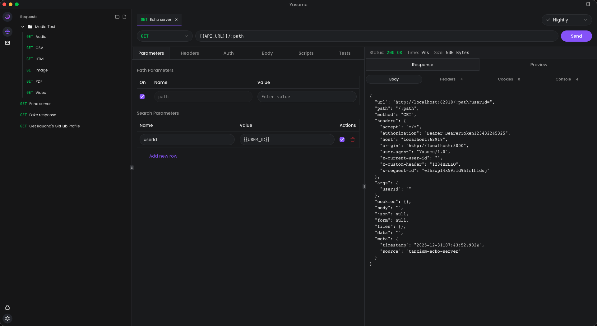
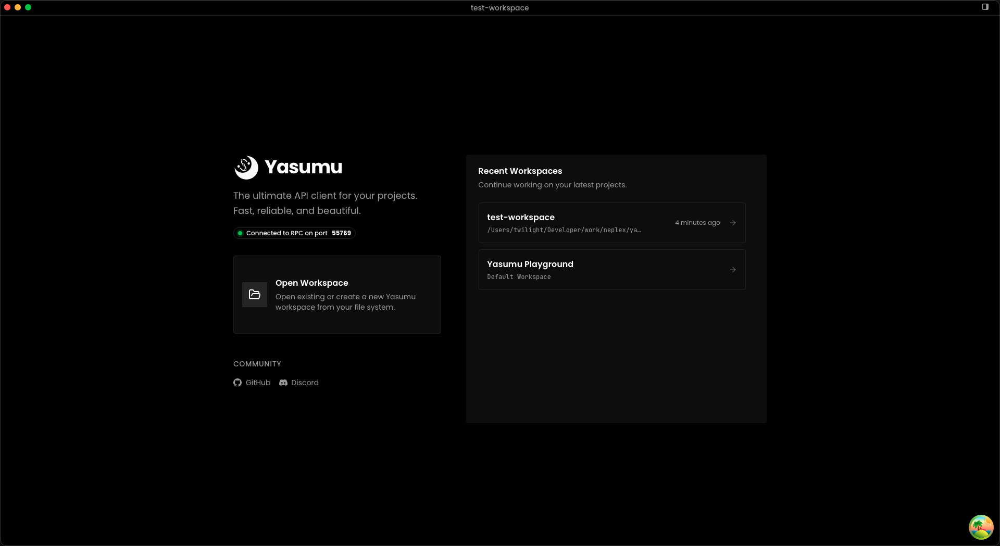

# Yasumu

**The modern, open-source API laboratory for designing, testing, and debugging workflows.**

[Download](https://yasumu.dev/download) • [Documentation](https://docs.yasumu.dev) • [Contributing](CONTRIBUTING.md)

---

> [!IMPORTANT]
> **Yasumu is currently in active Beta.**
> We are rapidly prototyping and iterating. While the core is functional, you may encounter unfinished features or bugs. We highly value your feedback and contributions as we polish the experience toward a stable v1.0 release!

## Overview

**Yasumu** is built for developer productivity, speed, and freedom. It uses **Tauri** as the desktop shell with a **Next.js** frontend, while the core backend runs on an embedded custom JavaScript runtime powered by **Deno**.

It feels like the tools you already know, but with the flexibility to handle complex, experimental workflows directly in your file system.

## Why Yasumu?

Most API clients store your collections in proprietary formats or require cloud accounts just to use basic features. Yasumu takes a different approach: everything lives in your project folder as plain `.ysl` files that you can commit, diff, and review like any other code.

The app runs on Tauri with an embedded custom JavaScript runtime powered by Deno. This handles everything from request execution to scripting—write your pre-request logic in TypeScript without setting up external tooling.

No account required. No cloud sync. No paid tiers. Just a tool that works offline and stays out of your way.

## Interface

<table>
  <tr>
    <td align="center">
       
      <b>Project Workspace</b>
    </td>
    <td align="center">
       
      <b>REST Client</b>
    </td>
  </tr>
</table>

## Protocol Support

Yasumu is evolving to become a protocol-agnostic powerhouse.

| Protocol               | Status | Notes                                     |
| :--------------------- | :----: | :---------------------------------------- |
| **REST API**           |   ✓    | Full HTTP/HTTPS request support           |
| **Catch-all SMTP**     |   ✓    | Integrated local email server for testing |
| **GraphQL**            |   —    | In development                            |
| **WebSocket**          |   —    | In development                            |
| **Server-Sent Events** |   —    | In development                            |
| **Socket.IO**          |   —    | In development                            |

## Concepts & Workflow

Yasumu acts as an **IDE for your API interactions**. Unlike tools that hide data in proprietary databases or cloud silos, Yasumu lives in your repo.

### Project-Based Workspaces

When you initialize Yasumu in a project, it creates a `yasumu` directory. Your definitions, tests, and workflows are stored here using the **Yasumu Schema Language (.ysl)**—a custom format designed for readability and clean git diffs.

### Collaboration via Git

- **Commit & Push:** Treat your API collections as code.
- **Review:** `.ysl` files are text-based, making Pull Request reviews easy.
- **Sync:** Teammates simply pull the branch to get the latest API workflows.
- **Secure:** Sensitive secrets are managed via local environment variables, never committed to version control.

### Runtime Architecture

Tauri provides the desktop shell and OS-level operations. The backend—request execution, scripting, and core logic—runs on an embedded custom JavaScript runtime built on `deno_runtime`.

## Tech Stack

- **Frontend:** Next.js (React)
- **Desktop Shell:** Tauri
- **Backend Runtime:** Embedded custom JS runtime powered by Deno
- **Platforms:** Windows, Linux, macOS

## Installation

Get the latest installer for your operating system:

**[Download Yasumu](https://yasumu.dev/download)**

## Philosophy

- **Open Source by Default:** Transparency builds trust.
- **Zero Vendor Lock-in:** Your data belongs to you, on your disk.
- **Developer Experience First:** Fast, beautiful, and keyboard-friendly.
- **Sustainability:** Built for long-term maintainability over hype.

## License

Yasumu is developed by [Neplex](https://neplextech.com) and is licensed under the **AGPL-3.0**. See [LICENSE](LICENSE) for details.
